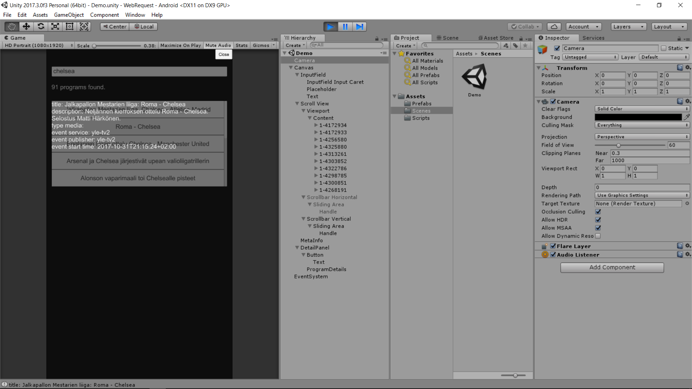

# Unity-UnityWebRequest
This repo was created for an assignment that would require you to implement various functions incorporating with Unity UI, UnityWebRequest, JSON Parsing.




YLE API Documentation -> http://developer.yle.fi/api_docs.html

`APIConfidentialData.cs` is ignored from the repository since the file contains my API id and key. Therefore I just decided to paste it. This would be one of the ways to omit confidential strings from your code.

```csharp
using System.Collections;
using System.Collections.Generic;

public class APIConfidentialData {
    string YOUR_APP_ID = "get_yours";
    string YOUR_APP_KEY = "get_yours";
    public string getAppId()
    {
        return YOUR_APP_ID;
    }

    public string getAppKey()
    {
        return YOUR_APP_KEY;
    }
}
```
Video on YouTube(https://youtu.be/MjLF-PMqE_s).